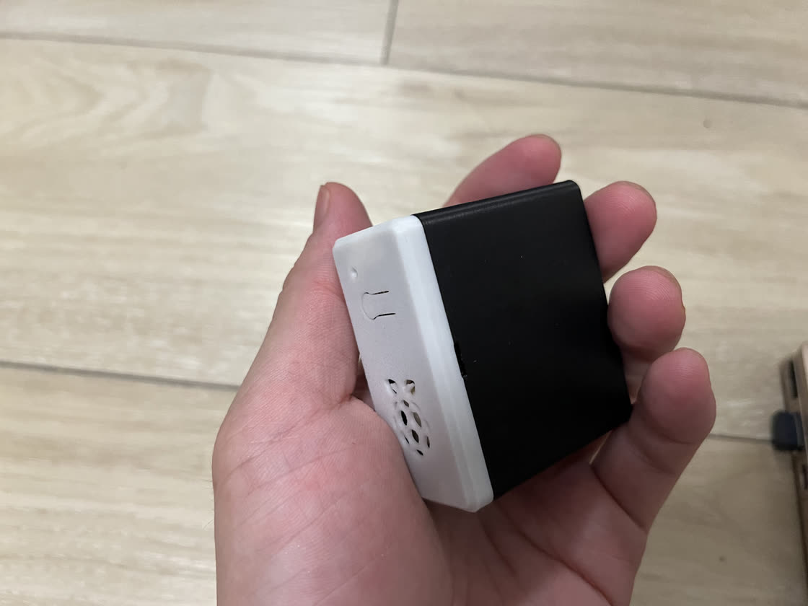
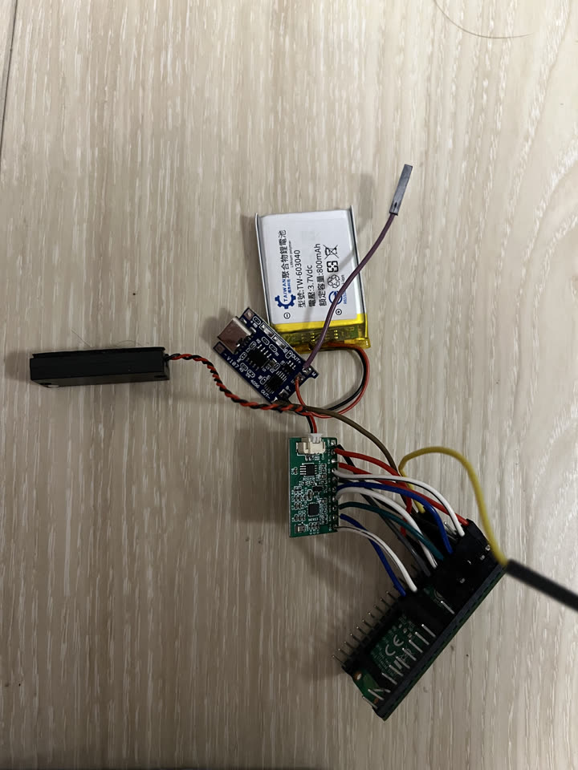

pico-talk
=========

A voice conversation demo based on Zephyr and Raspberry Pi Pico 2 W
(``rpi_pico2/rp2350a/m33/w``), using the OpenAI Realtime API.

Hardware wiring
---------------

::

   ES8311                 Raspberry Pi Pico 2 W
                                Micro-USB
                            +-------+-------+
   PA_EN   <--- GP0    1 o |               | o 40 VBUS
   DSDIN   <--- GP1    2 o |               | o 39 VSYS <--- BATTERY +
   GND     ---- GND    3 o |               | o 38 GND  ---- BATTERY -
   DSOUT   ---> GP2    4 o |               | o 37 3V3_EN
   MCLK    <--- GP3    5 o |               | o 36 3V3 ---> VCC
   BCLK    ---> GP4    6 o |               | o 35 ADC_VREF
   LRCK    ---> GP5    7 o |               | o 34 GP28
                  GND  8 o |               | o 33 AGND
   SDA     <--> GP6    9 o |               | o 32 GP27
   SCL     <--> GP7   10 o |               | o 31 GP26
                  GP8 11 o |               | o 30 RUN
                  GP9 12 o |               | o 29 GP22
                  GND 13 o |    RP2350     | o 28 GND
                 GP10 14 o |               | o 27 GP21
                 GP11 15 o |               | o 26 GP20
                 GP12 16 o |               | o 25 GP19
                 GP13 17 o |               | o 24 GP18
                  GND 18 o |   CYW43439    | o 23 GND  ---- UART GND
                 GP14 19 o |               | o 22 GP17 <--- UART TX
                 GP15 20 o |               | o 21 GP16 ---> UART RX
                            +---- antenna ----+

Prerequisites
-------------

* Git
* Python 3.12 or newer with ``venv`` support
* CMake 3.20 or newer
* Ninja

Configure credentials
---------------------

Before building, set the Wi-Fi credentials and OpenAI API key in
``prj.conf``::

   CONFIG_WIFI_SSID="YOUR_WIFI_SSID"
   CONFIG_WIFI_PSK="YOUR_WIFI_PASSWORD"
   CONFIG_OPENAI_API_KEY="YOUR_OPENAI_API_KEY"

Build
-----

Create a new workspace and download the dependencies::

   mkdir -p pico-clip-workspace
   cd pico-clip-workspace

   git clone https://github.com/sepfy/pico-clip.git
   python3 -m venv pico-clip/.venv
   pico-clip/.venv/bin/python -m pip install --upgrade pip west

   pico-clip/.venv/bin/python -m west init -l pico-clip
   pico-clip/.venv/bin/python -m west update
   pico-clip/.venv/bin/python -m pip install \
     -r zephyr/scripts/requirements-base.txt
   pico-clip/.venv/bin/python -m west sdk install \
     --gnu-toolchains arm-zephyr-eabi

Download the CYW43439 Wi-Fi firmware::

   pico-clip/.venv/bin/python -m west blobs \
     -l 'img/whd/resources/(firmware/COMPONENT_43439/43439A0\.bin|clm/COMPONENT_43439/COMPONENT_MURATA-1YN/43439A0\.clm_blob)' \
     fetch hal_infineon

Configure ``pico-clip/prj.conf`` as shown above, then build::

   cd pico-clip
   ./scripts/build.sh make

The generated firmware is located at::

   build/pico2w_pico_clip/zephyr/zephyr.uf2

Usage
-----

#. Power on the Pico 2 W.
#. Wait for the onboard LED to turn on, indicating that the connection is
   ready.
#. Press and hold the BOOTSEL button while speaking, then release it when
   finished.
